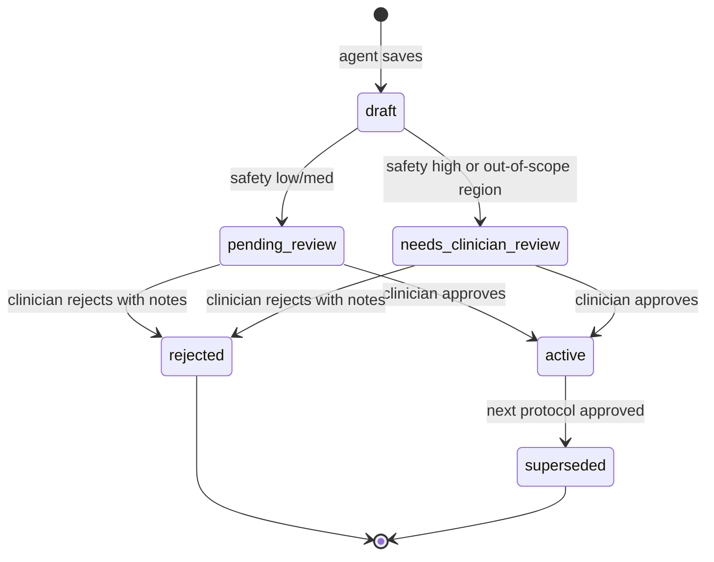

# Architecture

Single source of truth for the rehab-as-code system shape. Updated **in
the same PR** as any change that alters the diagram (route added, new
agent in the pipeline, new persistence layer). If the diagram and the
code disagree, the diagram is wrong — fix it.

CLAUDE.md and AGENTS.md reference this file. They no longer carry
their own ASCII diagrams.

## System overview

```mermaid
flowchart TB
    classDef patient fill:#1d2742,stroke:#4fb3c4,color:#e8eef7
    classDef clinician fill:#1d2742,stroke:#7a9eff,color:#e8eef7
    classDef llm fill:#2a2218,stroke:#c89b6c,color:#e8eef7
    classDef store fill:#1a3329,stroke:#5fd09a,color:#e8eef7
    classDef gate fill:#3a1820,stroke:#ff6b7a,color:#e8eef7

    Patient([Patient browser]):::patient
    Clinician([Clinician browser]):::clinician

    subgraph FE [Frontend - vanilla JS]
        AppJS[app.js + index.html]
        ClinJS[clinician.js + clinician.html]
        PoseJS[pose.js MediaPipe in-browser]
    end

    subgraph FA [FastAPI on Vercel Fluid Compute]
        AuthMW[auth - JWT verify - Depends current_user_id]:::gate
        ObsMW[observability_request_context - RunContext]
        ChatRoute[/chat - Coach Maya]:::llm
        PatientRoute[/patient/interact - orchestrator]
        PoseRoute[/pose/session]
        ClinRoute[/protocols/pending /approve /reject]
        AdminRoute[/admin/* - api/admin.py]
        SessionsRoute[/sessions/today /recent]
        StartRoute[/start-session - mint Tavus conversation]
        TavusProxy[/tavus/llm - BYO-LLM proxy]:::llm
        JunctionRoute[/api/junction link refresh status]
    end

    subgraph Pipeline [Multi-agent plan generation - Anthropic Sonnet 4.6]
        Orch[plan_generation_agent.handle]:::llm
        Researcher[researcher.candidates]:::llm
        Trend[trend_analyst.analyze - deterministic stats post-PR-90]
        Evaluator[evaluator.signal]:::llm
        Planner[planner.compose]:::llm
        Safety[safety_reviewer.review]:::llm
    end

    subgraph Supabase [Supabase Postgres - RLS by auth.uid]:::store
        Users[(users staff_users)]
        Intake[(intake_records)]
        Health[(health_records)]
        Sessions[(sessions checkins)]
        Protocols[(protocols active pending_review)]
        Tavus[(tavus_sessions +session_ref)]
        Junctions[(junction_connections)]
        Runs[(pipeline_runs)]
    end

    subgraph Observability
        Trace[backend/observability]
        Langfuse[backend/langfuse_client - kill-switched]
    end

    Patient --> AppJS
    Patient --> PoseJS
    Clinician --> ClinJS

    AppJS --> AuthMW
    PoseJS --> AuthMW
    ClinJS --> AuthMW
    AuthMW --> ObsMW
    ObsMW --> ChatRoute
    ObsMW --> PatientRoute
    ObsMW --> PoseRoute
    ObsMW --> ClinRoute
    ObsMW --> AdminRoute
    ObsMW --> SessionsRoute

    ChatRoute -.maya tools.-> SymptomCl[symptom_classifier - Haiku]:::llm
    ChatRoute -.draft.-> Drafter[chat_protocol_drafter - Sonnet]:::llm

    PatientRoute --> Orch
    Orch --> Researcher
    Orch --> Trend
    Orch --> Evaluator
    Evaluator --> Planner
    Planner --> Safety
    Safety --> Protocols

    ClinRoute --> Diff[diff_narrator - Haiku]:::llm
    ClinRoute --> Protocols

    PoseRoute --> Sessions
    SessionsRoute --> Sessions
    SessionsRoute --> Protocols
    AdminRoute --> Runs

    Researcher -. trace_sync .-> Runs
    Trend -. trace_sync .-> Runs
    Evaluator -. trace_sync .-> Runs
    Planner -. trace_sync .-> Runs
    Safety -. trace_sync .-> Runs
    SymptomCl -. trace_sync .-> Runs
    Diff -. trace_sync .-> Runs

    ObsMW -. when LANGFUSE_ENABLED .-> Langfuse
    Researcher -. anthropic OTel .-> Langfuse
    Planner -. anthropic OTel .-> Langfuse
    Safety -. anthropic OTel .-> Langfuse

    PatientRoute --> Intake
    PatientRoute --> Health
    PatientRoute --> Users

    %% Video coach: BYO-LLM avatar + live rep-counting
    TavusCVI([Tavus CVI - Daily WebRTC - Phoenix Sparrow Raven]):::patient
    Junction([Junction Vital - 300+ wearables]):::store
    AppJS --> StartRoute
    StartRoute --> Tavus
    StartRoute --> TavusCVI
    Patient --> TavusCVI
    TavusCVI -. custom LLM x-api-key .-> TavusProxy
    TavusProxy -. same coach_chat brain as /chat .-> ChatRoute
    TavusProxy -. recover patient via session_ref .-> Tavus
    PoseJS -. conversation.echo per real rep .-> TavusCVI
    JunctionRoute --> Junctions
    JunctionRoute -. x-vital-api-key .-> Junction
    Health -. junction-first else mock .-> Junction
```

## Video coach: BYO-LLM avatar + live rep-counting

The Tavus avatar runs in **bring-your-own-LLM** mode: the persona's LLM layer
points at `backend/api/tavus_proxy.py` (`POST /tavus/llm/chat/completions`,
shared-secret auth), so Tavus calls *our* OpenAI-compatible endpoint as its
model. The proxy recovers the patient (opaque per-conversation `session_ref`
embedded in `conversational_context`, or Tavus `conversation_id`), strips
system messages, re-reads live Supabase state, and drives the **same
`coach_chat` brain as the text chat** — one brain, same tools, same
clinician-review safety loop. The call embeds via the Daily JS SDK so the
client can send Tavus interactions. During a guided set, `pose.js` runs
MediaPipe on the call's camera and fires a Tavus `conversation.echo` on each
*detected* rep so the avatar speaks the count — gated on real movement, never
a timer.

## Wearables: Junction (Vital)

`get_health_data(token)` is the single seam every consumer reads.
**Junction** (`backend/junction_client.py` + `backend/api/junction.py`, the
`junction_connections` table) is the highest-precedence real source when a
patient has connected a device; it **fail-opens to the mock defaults** on
not-connected / stale / error, so the pipeline and avatar never lose data.
PHI note: real patient data flowing to Tavus *and* Junction is BAA-gated —
sandbox / test patients only until signed.

## Trust loop state machine



Unique partial index `protocols_one_active_per_token` keeps `active`
singular per patient. The state transitions happen in
`backend/protocol_repo.py:approve|reject`.

## Body-region anchoring

Every drafter / planner LLM call injects the patient's body region. After
the LLM returns, `clinical_taxonomy.resolve_body_region(injury_type)` +
`exercise_kb.body_region_for(exercise_id)` validate that no exercise
crosses regions. New exercises in `knowledge/exercise-library.json` need
`body_region` populated. Library coverage is in-scope for **knee + ankle**
(per the 2026-05-07 scoping decision); other regions route to
`needs_clinician_review` automatically.

## Observability (two layers)

| Layer | Where | What it answers |
|---|---|---|
| `pipeline_runs` table | `backend/observability/trace.py` writes per agent | Audit-of-record. "What did agent X decide for patient Y at time T?" Joined to admin dashboard via `request_id` |
| Langfuse (self-hosted) | `backend/langfuse_client.py` when `LANGFUSE_ENABLED=true` | Prompt/response inspection. "Why did the agent give that answer?" PHI-redacted via mask callback |

Same `request_id` (UUID set by `observability_request_context` middleware)
flows into both. Use it to drill from one to the other.

## Update protocol

When you change any of these, update this file in the same PR:

- A new route mounts on `app` (or a router moves to `routes/*.py`)
- A new sub-agent enters or leaves the pipeline
- A new top-level table is added (or a key table is renamed — see the
  `clinicians` → `staff_users` VIEW timebomb in CLAUDE.md)
- A new persistence layer or external service is added
- The trust-loop state machine gains or loses a state

Validation pass when you change the diagram: check the rendered Mermaid
in the GitHub PR preview. Mismatched arrows / typoed node names break
silently; the GitHub UI shows the actual graph.
